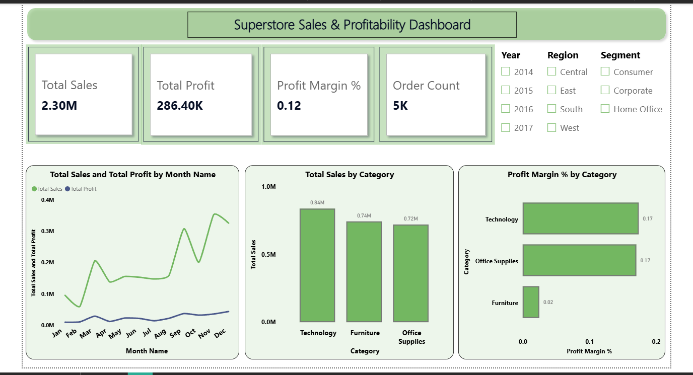
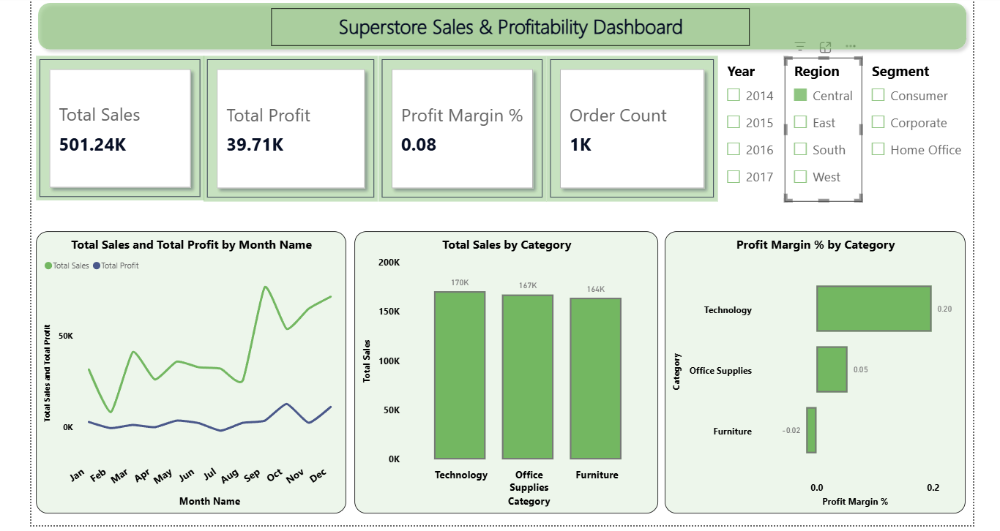
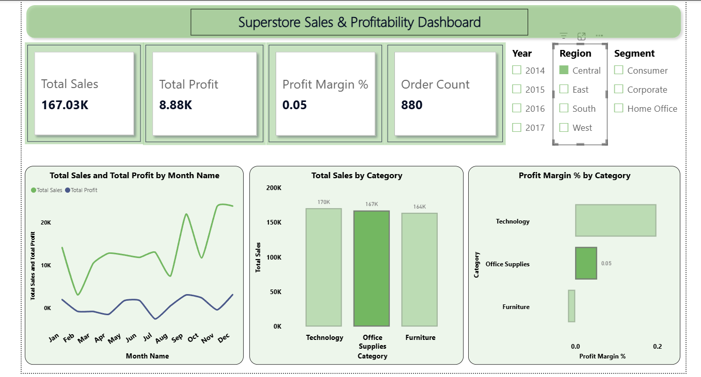

# 📊 Task 2 – Power BI Sales Dashboard

This project was completed as part of my **Elevate Labs Data Analyst Internship**.

## 📌 Overview
Built an interactive Power BI dashboard using the Superstore dataset to analyze sales, profit, and business performance.

## 🛠 Tools Used
- Power BI
- Power Query
- DAX
- Microsoft Excel

## 📈 Dashboard Features
- Total Sales, Profit, Profit Margin & Order Count KPIs
- Monthly Sales & Profit Trend
- Sales by Category
- Profit Margin by Category
- Interactive slicers (Year, Region, Segment)

## 📊 Key Insights
- Technology generated the highest sales.
- Furniture had the lowest profit margin.
- Sales peaked towards the end of the year.
- Dashboard supports dynamic filtering for better analysis.

## 📷 Dashboard Preview

### Overall Dashboard

### Region Filter

### Filtered Dashboard

## 📁 Files
- `Task 2 Power bi project.pbix` – Power BI Dashboard
- `Sample - Superstore.xlsx` – Dataset

---
**Internship:** Elevate Labs – Data Analyst Internship
